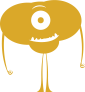
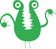
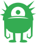
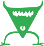
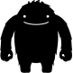

<div class="output-container">

  <style type="text/css">
    .row {
      display: grid;
      grid-template-columns: auto auto auto;
      text-align: center;
      padding: 20px;
      background-color: wheat;
    }

    .grid {
      min-height: 6em;
      padding: 1em;
    }

    img {
      height: 100%;
      width: 24%;
    }

    .button {
      border-color: white;
      outline: none;
      border: none;
      margin-top: 5px;
      padding: 5px 10px;
      border-radius: 3px;
      font-weight: 600px;
      cursor: pointer;
    }

    .button:focus {
      border: red;
      outline: none;
      box-shadow: 0 0 3px 1px #8e45ff;
    }

    .button:active {
      color: #8e45ff;
    }
  </style>

  <button class="button" value="monsters">Shuffle!</button>

  <div id="app">
    <div class="row">
      <div class="grid"></div>
      <div class="grid"></div>
      <div class="grid"></div>
      <div class="grid"></div>
      <div class="grid"></div>
      <div class="grid"></div>
      <div class="grid"></div>
      <div class="grid"></div>
      <div class="grid"></div>
      <div class="grid"></div>
      <div class="grid"></div>
      <div class="grid"></div>
    </div>
  </div>

  <footer>
    <p class="text-small text-muted">Icons by 
      <a href="https://thenounproject.com/term/door/311732/">Jamie Dickinson</a>, 
      <a href="https://thenounproject.com/term/monster/184225/">Nicky Knicky</a>, 
      <a href="https://thenounproject.com/term/monster/1510400/">Alvaro Cabrera</a>, 
      <a href="https://thenounproject.com/term/monster/28460/">Eliricon</a>, 
      <a href="https://thenounproject.com/term/monster/82823/">April Yang</a>, 
      <a href="https://thenounproject.com/term/monster/1062009/">tk66</a>, 
      <a href="https://thenounproject.com/term/monster/24990/">Alex WaZa</a>, 
      <a href="https://thenounproject.com/term/monster/37212/">Husein Aziz</a>, 
      <a href="https://thenounproject.com/term/monster/2236082">iconcheese</a>,<br/> 
      and <a href="https://thenounproject.com/term/socks/38451/">Yazmin Alanis</a>.</p>
  </footer>

  <script>
    const shuffleBtn = document.querySelector('.button');
    const app = document.querySelector('#app');

    const monsters = [
      'monster1',
      'monster2',
      'monster3',
      'monster4',
      'monster5',
      'monster6',
      'monster7',
      'monster8',
      'monster9',
      'monster10',
      'monster11',
      'sock'
    ];

    const render = function () {
      app.innerHTML = '<div class="row">' + monsters.map(monster => {
        return (`
          <div class="grid"></div>
        `)
      }).join('');
    };

    const shuffleArr = function (arr) {
      var currentIndex = arr.length;
      var temporaryValue, randomIndex;

      while (0 !== currentIndex) {
        randomIndex = Math.floor(Math.random() * currentIndex);
        currentIndex -= 1;

        temporaryValue = arr[currentIndex];
        arr[currentIndex] = arr[randomIndex];
        arr[randomIndex] = temporaryValue;
      }
      render();
      return arr;
    }

    shuffleBtn.addEventListener('click', function() {
      shuffleArr(monsters);
    });
  </script>

</div>

<div class="html-container" style="border-top: .5px solid grey; margin-top: 30px;">

## HTML

```HTML
<button class="button" value="monsters">Shuffle!</button>

  <div id="app">
    <div class="row">
      <div class="grid"></div>
      <div class="grid"></div>
      <div class="grid"></div>
      <div class="grid"></div>
      <div class="grid"></div>
      <div class="grid"></div>
      <div class="grid"></div>
      <div class="grid"></div>
      <div class="grid"></div>
      <div class="grid"></div>
      <div class="grid"></div>
      <div class="grid"></div>
    </div>
  </div>

  <footer>
    <p class="text-small text-muted">Icons by 
      <a href="https://thenounproject.com/term/door/311732/">Jamie Dickinson</a>, 
      <a href="https://thenounproject.com/term/monster/184225/">Nicky Knicky</a>, 
      <a href="https://thenounproject.com/term/monster/1510400/">Alvaro Cabrera</a>, 
      <a href="https://thenounproject.com/term/monster/28460/">Eliricon</a>, 
      <a href="https://thenounproject.com/term/monster/82823/">April Yang</a>, 
      <a href="https://thenounproject.com/term/monster/1062009/">tk66</a>, 
      <a href="https://thenounproject.com/term/monster/24990/">Alex WaZa</a>, 
      <a href="https://thenounproject.com/term/monster/37212/">Husein Aziz</a>, 
      <a href="https://thenounproject.com/term/monster/2236082">iconcheese</a>,<br/> 
      and <a href="https://thenounproject.com/term/socks/38451/">Yazmin Alanis</a>.</p>
  </footer>
```

</div>
<div class="js-container">

## JavaScript

```JS
/* Each monster (or sock) has a matching SVG in the source code.
For example, there’s a monster3 in the array, and a monster3.svg in the source code.
Shuffle the array of monsters, and render the matching SVG files into the #app element. */

const shuffleBtn = document.querySelector('.button');
const app = document.querySelector('#app');

const monsters = [
  'monster1',
  'monster2',
  'monster3',
  'monster4',
  'monster5',
  'monster6',
  'monster7',
  'monster8',
  'monster9',
  'monster10',
  'monster11',
  'sock'
];

const render = function () {
  app.innerHTML = '<div class="row">' + monsters.map(monster => {
    return (`
      <div class="grid"></div>
    `)
  }).join('');
};

const shuffleArr = function (arr) {
  var currentIndex = arr.length;
  var temporaryValue, randomIndex;

  while (0 !== currentIndex) {
    randomIndex = Math.floor(Math.random() * currentIndex);
    currentIndex -= 1;

    temporaryValue = arr[currentIndex];
    arr[currentIndex] = arr[randomIndex];
    arr[randomIndex] = temporaryValue;
  }
  render();
  return arr;
}

shuffleBtn.addEventListener('click', function() {
  shuffleArr(monsters);
});

```

</div>
